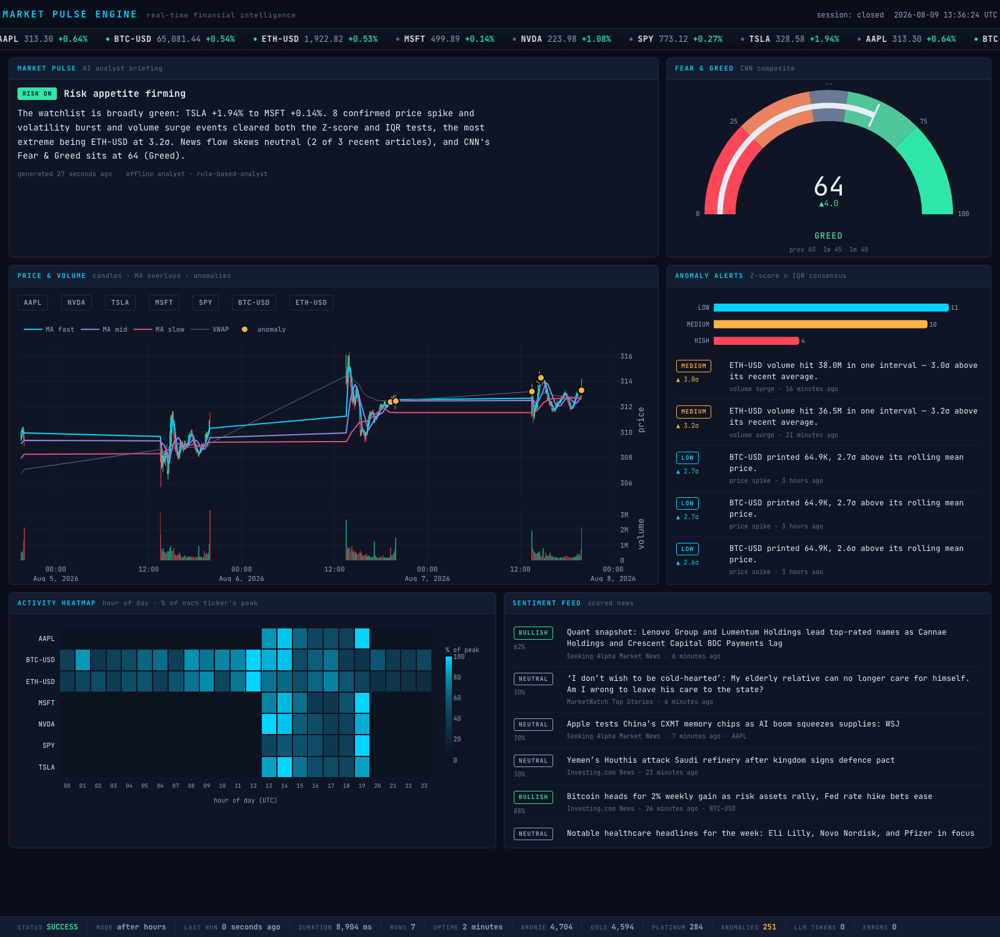

# Market Pulse Engine

[](https://github.com/sennurbascetin/market-pulse-engine/actions/workflows/ci.yml)
[](https://www.python.org/)
[](LICENSE)

**A real-time financial data pipeline that explains *why* the market is moving, not just *that* it is.**

Every cycle the engine ingests live prices, breaking financial news and the CNN Fear & Greed
Index; folds them through a four-layer medallion warehouse in DuckDB; confirms statistical
anomalies with a dual-method consensus test; scores news sentiment; and writes a short
**Market Pulse** briefing — an analyst note assembled only from facts the pipeline actually
measured. It all lands on a dark-mode terminal dashboard that refreshes itself.



```bash
git clone https://github.com/sennurbascetin/market-pulse-engine.git
cd market-pulse-engine
python3 -m venv .venv
source .venv/bin/activate          # Windows: .venv\Scripts\activate
pip install -r requirements.txt
python run.py --backfill
```

Then open **http://127.0.0.1:8050**. No API keys, no accounts, no configuration.

> **`zsh: command not found: python`?** macOS ships `python3`, not `python`. Either activate
> the virtualenv first (`source .venv/bin/activate`, after which plain `python` works and your
> prompt shows `(.venv)`), or skip activation entirely and call the venv's interpreter directly:
> ```bash
> .venv/bin/python run.py --backfill
> ```
> The first run takes ~30 seconds: it downloads five days of intraday history before serving.

---

## Why it is built this way

Three decisions do most of the work.

**The transform layer is SQL, not Pandas.** Moving averages, intraday and period returns,
log-return volatility, session VWAP and three families of rolling z-score are one chained
DuckDB query over window functions. A full Bronze → Gold rebuild of **4,573 observations runs
in 126 ms**. There is not a single row-by-row loop in the transform path.

**Anomalies need two independent methods to agree.** A z-score is sensitive but assumes
roughly normal data and is dragged around by the very outlier it is hunting. A Tukey/IQR fence
is distribution-free and robust but blunt. An event is recorded only when *both* fire. Measured
on this dataset, the consensus rule suppresses **9.4% of z-score-only hits** (605 → 548 across
13,707 metric evaluations). That is a real reduction, and it is the measured number rather than
a claim.

**The AI layer degrades instead of breaking.** The analyst backend is pluggable — a hosted
model or a built-in offline analyst — resolved at runtime. A missing key, a failed request
or a malformed response falls back *per item*, so the pipeline never stops producing insight
because a vendor is having a bad afternoon.

---

## The intelligence layer

The brief for this project specified `gpt-5-mini` as "built-in, no external API key needed".
That is not true of a standalone Python service, so the engine treats the analyst as a
**pluggable backend** and picks the best one available:

| `MPE_LLM_PROVIDER` | Backend | Requires |
|---|---|---|
| `auto` *(default)* | first available of the below | — |
| `openai` | `gpt-5-mini` via the OpenAI SDK | `OPENAI_API_KEY` |
| `heuristic` | offline analyst — no network, no cost | nothing |

Adding a provider is one class implementing `complete()` plus a line in `get_provider()`.

The offline analyst is **not a stub**. It scores sentiment with a weighted financial lexicon
(with word-boundary negation handling) and composes the narrative from the same measured facts
a remote model would be shown. It writes the identical Platinum records, so the pipeline, the
dashboard and every downstream query behave the same either way. Adding a key upgrades the
prose without changing a line of code.

A briefing produced entirely offline, from real market data:

> **Risk appetite firming** — *The watchlist is broadly green: TSLA +1.94% to MSFT +0.14%.
> 8 confirmed price spike and volume surge events cleared both the Z-score and IQR tests, the
> most extreme being ETH-USD at 3.2σ. News flow skews neutral (2 of 3 recent articles), and
> CNN's Fear & Greed sits at 64 (Greed).*

Every number in that paragraph is traceable to a row in Gold or Platinum. The exact context the
analyst was shown is stored as JSON alongside its answer in `platinum.market_pulse_narratives`,
so any briefing can be audited after the fact.

---

## Data model

```
bronze    raw_quotes · raw_news · raw_sentiment_index      exact payloads, append-only
silver    quotes · news_articles · sentiment_index         typed, cleaned, deduplicated
gold      quotes_enriched · daily_summary                  metrics and aggregates
platinum  anomalies · news_sentiment · market_pulse_narratives
pipeline  run_log                                          operational bookkeeping
```

Full diagram: [`docs/architecture.mmd`](docs/architecture.mmd) · design notes:
[ARCHITECTURE.md](ARCHITECTURE.md)

Every Bronze row carries a deterministic natural key (`sha256` of its identity), so ingestion is
idempotent: re-fetching the same observation is discarded by `ON CONFLICT DO NOTHING` rather
than duplicated. The same property makes the anomaly scan safe to re-run over any window.

---

## Two problems worth calling out

**Volume means two different things.** Historical 5-minute bars report the volume traded *within
the bar*; live snapshots report *session-to-date* volume. Averaging them together would poison
every volume z-score. Silver records which basis each row uses, and Gold reconciles them into a
comparable per-observation `volume_delta` using a windowed `last_value(… IGNORE NULLS)`. The
first cumulative reading of a session deliberately contributes **zero** — its volume accrued
before the engine was watching, and booking it as one interval's trade would manufacture a huge
false surge every time the pipeline starts mid-session.

**A 24-hour heatmap shows nothing on a weekend.** The equities genuinely did not trade, so a
rolling wall-clock window renders two crypto rows and five empty ones. Folding several days onto
a 0–23 hour-of-day axis instead surfaces each asset's *activity profile* — the US session block
for equities, round-the-clock for crypto — which is the question the panel is actually asked.

---

## Usage

```bash
python run.py                  # pipeline + dashboard (the normal case)
python run.py --backfill       # pull real intraday history first, then run
python run.py --once           # a single cycle, then exit
python run.py --no-dashboard   # headless
python run.py --dashboard-only # serve without the scheduler
```

A `market-pulse` console script exposes each stage on its own:

```bash
market-pulse init | ingest | backfill | transform | analyse | run | dashboard | status
```

**Why one process?** DuckDB is embedded: a database file may be held read-write by exactly one
process. `run.py` therefore runs the scheduler on a background thread beside the Dash server so
the writer and the reader share a single database instance. Starting a second instance reports
which PID holds the lock and what to do about it, rather than a stack trace.

Stop the engine with **Ctrl-C** (or `kill`). Both are handled: the scheduler stops and DuckDB is
closed and checkpointed. That matters — a process killed mid-write can leave the index behind a
`PRIMARY KEY` inconsistent with its rows, which aborts the *next* run with a fatal error. If a
database is already in that state, the engine detects it and rebuilds the affected table's index
without losing a row (`db/repair.py`). `kill -9` is the one case nothing can protect against.

### Configuration

Every setting is an `MPE_`-prefixed environment variable with a working default — see
[`.env.example`](.env.example). The most useful:

| Variable | Default | Meaning |
|---|---|---|
| `MPE_WATCHLIST` | `AAPL,NVDA,TSLA,MSFT,SPY,BTC-USD,ETH-USD` | instruments to track |
| `MPE_POLL_SECONDS` | `60` | seconds between cycles |
| `MPE_LLM_EVERY_N_RUNS` | `5` | throttle for the paid stage |
| `MPE_ZSCORE_THRESHOLD` | `2.5` | z-score arm of the consensus rule |
| `MPE_IQR_MULTIPLIER` | `1.5` | Tukey fence multiplier |
| `MPE_DEMO_MODE` | `false` | synthetic ticks when markets are shut — see [DEMO_MODE.md](DEMO_MODE.md) |

---

## Dashboard

Eight panels, one 60-second refresh: **live ticker tape**, the **Market Pulse briefing**, a
**Fear & Greed gauge**, **candlesticks** with MA overlays and anomaly markers, an **activity
heatmap**, a **sentiment feed**, the **anomaly alert log**, and a **pipeline health bar**.

The palette follows the brief — deep navy, electric cyan, amber, red — but every colour that
carries data meaning was validated computationally against the `#0a0e1a` surface (OKLab ΔE under
simulated protanopia and deuteranopia, plus WCAG contrast) rather than chosen by eye. That check
rejected the conventional trading green `#3fb950`: against this red it scores **ΔE 1.2** under
both protanopia and deuteranopia — effectively the same colour for roughly one in twelve men.
The mint `#2ee6a8` used instead scores **14.9**. Direction is additionally carried by the sign
on every number and by candle geometry, so colour is never the only encoding, and every status
badge ships with its text label.

---

## Testing

```bash
pytest
```

**113 tests, ~4 seconds, fully offline** — every external API is mocked and every test runs
against a throwaway DuckDB file.

| File | Covers |
|---|---|
| `test_ingestion.py` | Bronze schema compliance, idempotency, graceful source failure |
| `test_transforms.py` | hand-computed MA / VWAP / return / volume-delta correctness |
| `test_anomaly_detector.py` | consensus logic, injected spikes, severity bands |
| `test_llm_analyst.py` | response parsing, schema validation, provider fallback |
| `test_pipeline.py` | market-hours gating, run-log bookkeeping, stage degradation |
| `test_db.py` | lock reporting, index-damage detection and lossless repair |

Assertions check specific hand-computed numbers, so a regression in the SQL surfaces as a wrong
value rather than "something changed".

---

## Docker

```bash
docker compose up --build     # dashboard on http://localhost:8050
```

---

## Stack

Python 3.11+ · DuckDB · yfinance · feedparser · APScheduler · Plotly Dash · pytest

Data sources are free and key-less. yfinance data is delayed for some exchanges; records carry
an `is_live` flag and the dashboard labels stale prices.

## Licence

MIT — see [LICENSE](LICENSE).

*Not investment advice. This is a data-engineering portfolio project.*
